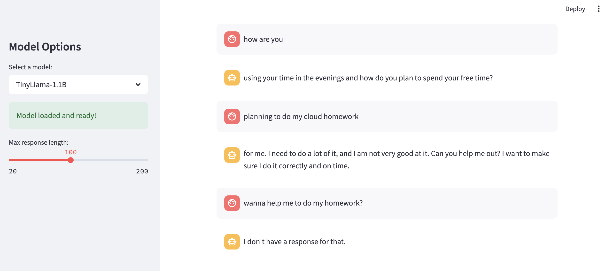

# Streamlit Hugging Face Chatbot

A simple web application built with Streamlit that lets you chat with open-source language models from Hugging Face.

## Features

- Chat interface with message history
- Select from different pre-trained models
- Adjust maximum response length
- Responsive UI

## Local Development

### Prerequisites

- Python 3.8+
- pip

### Setup

1. Clone the repository:
```bash
git clone https://github.com/linhui7/streamlit_huggingface_app.git
cd streamlit_huggingface_app
```

2. Create a virtual environment:
```bash
python -m venv venv
source venv/bin/activate  # On macOS/Linux
# venv\Scripts\activate  # On Windows
```

3. Install dependencies:
```bash
pip install -r requirements.txt
```

4. Run the app locally:
```bash
streamlit run app/main.py
```

## Available Models

- **Tiny Random LLaMA**: A small, fast-loading model for testing
- **TinyLlama-1.1B**: A more capable model with better response quality

## Deployment

The app is deployed on Streamlit Cloud: 

[Link here](apphuggingfaceapp-dkmzfj63gkvzc2snhfd3vc.streamlit.app)

## CI/CD

This project uses GitHub Actions for continuous integration and deployment:
- Linting with flake8
- Automated tests (to be added)

## Demo
